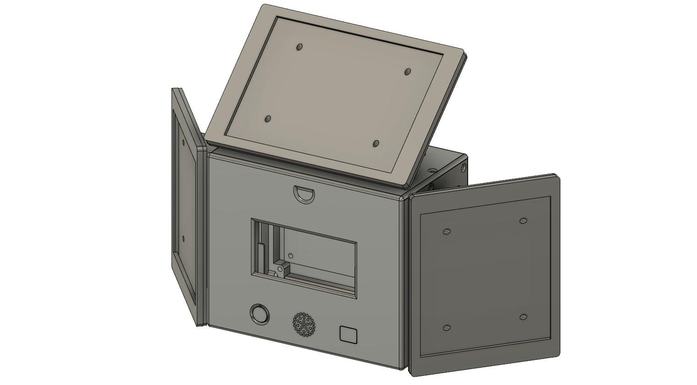

# Projet Long n°2
## _EI2I4 HF_ | _Groupe 2_

The goal of this project is to develop a complete device that can measure several physical datas and to make them available through a Human Machine Interface (HMI) on an internet application. This project will allow to recover and format the data measured by the sensors and then send them to a server (Cloud) thanks to the long range and low power technology (LPWAN).

## Features
- Autonomous: Rechargeable LiPo battery and indoor solar panels as power source
- Communication of information by LPWAN network (LoRAWAN): Data sending every 10 minutes (configurable)
- On/off button : Allows an instantaneous measurement
- LED that lights up for a few seconds when the system is started.
- Data display in graphical form on an internet application: Ubidots STEM during the development phase and an internal Polytech website for the final rendering of the project.

## Components
In order to realize this project, we had to find components that best respond to the imposed specifications by focusing on the main constraint which is the low consumption of the system:

| Components | Price |
| ------ | ------ |
| [E-Ink Screen](https://www.digikey.fr/en/products/detail/adafruit-industries-llc/4197/10060730) | 21.10€ |  
| [Indoor solar kit](https://www.mouser.fr/ProductDetail/PowerFilm/DEV-BASIC?qs=BJlw7L4Cy7%2Fw4dHFXPm5kg%3D%3D) | 55.97€ |
| [CO2, T°, Humidity Sensor](https://www.digikey.fr/fr/products/detail/seeed-technology-co.,-ltd/101020952/14672116?utm_adgroup=&utm_source=google&utm_medium=cpc&utm_campaign=PMAX%20Shopping_Product_Development%20Board&utm_term=&productid=14672116&gclid=CjwKCAiA3KefBhByEiwAi2LDHGC3sSf3_wtaYPH630ib0XKAaLsoO_e8GBNamO-FCIEC66xhhMLAGhoCcFoQAvD_BwE) | 48.36€ |
| [Noise Sensor](https://www.gotronic.fr/art-module-micro-mems-fermion-sen0487-34167.htm) | 3.50€ |
| [Light Sensor](https://www.digikey.fr/fr/products/detail/adafruit-industries-llc/5378/16056942?utm_adgroup=&utm_source=google&utm_medium=cpc&utm_campaign=PMAX%20Shopping_Product_Development%20Board&utm_term=&productid=16056942&gclid=CjwKCAiAl9efBhAkEiwA4ToriqFnO5TcQVJoOHX-VCiYtwIO2bZSYyVDAaRXxzhDUZyRP_28fs59SxoCnOUQAvD_BwE) | 4.64€ |
| [Battery](https://www.gotronic.fr/art-accu-lipo-3-7-vcc-1000-mah-pr523450-5813.htm) | 9.90€ |

For a total cost of 143.47€, we created [insert project name]. Responding to the specifications imposed, this energy autonomous system allows to manage the constants of a room in order to respect the sanitary conditions imposed by the school, or by any other organization.

## User interface
_TODO_
We used Ubitdots to display our datas etc.

## 3D Modeling
For this project I made a box to contain all the components as well as the PCB on which is mounted the Arduino MKR 1310 board and the indoors solar cells that allow the system to be self-sufficient in terms of energy.

### 3D folder tree

```bash
.
├── Projet_rev11.f3z
├── Boitier_rev05.f3d
├── Bouton_rev01.f3d
├── Dos-Boitier_rev02.f3d
├── Panneau-Solaire-Haut_rev02
├── Panneau-Solaire-Haut
│   ├── Cache-Panneau-Solaire-Haut
│   └── Support-Panneau-Solaire-Haut
├── Panneau-Solaire-Cotes_rev04
└── Panneau-Solaire-Cotes
    ├── Cache-Panneau-Solaire-Cotes
    └── Support-Panneau-Solaire-Cotes
```

### 3D Model

<details>
<summary>Picture</summary>


</details>

The model includes 9 total pieces:
| Part | Nb | Description |
| ------ | ------ | ------ |
| Boitier | x1 | The box is the structure of the system and allows to hold the different components and sensors of the project. |
| Dos-Boitier | x1 | The back of the case is removable and allows to fix the PCB directly on it. By removing this part, you can access the inside of the box. |
| Bouton | x1 | The custom button allows instant measurement. |
| Support-Panneau-Solaire-Haut | x1 | This support must be fixed on the top of the box and allows to hold the upper solar panel. |
| Cache-Panneau-Solaire-Haut | x1 |This cover allows the top solar panel to be plated against the support. |
| Support-Panneau-Solaire-Cotes | x2 | This support must be fixed on the side of the box and allows to hold the side solar panel. |
| Cache-Panneau-Solaire-Cotes| x2 | This cover allows the side solar panel to be pressed against the support. |

### Assembling
To assemble the parts together you need the parts listed above as well as the material below:
| Hardware | Nb | Type |  Description |
| ------ | ------ | ------ | ------ |
| Screws | x16 | M3x8mm | Allows to fix the upper and lateral supports of the solar panels. |
| Anti-skid pads | x4 | 10x3mm | Allows to elevate the case and to give it more grip on the ground. |

## Electronic schematics
## Schematics
### PCB

## Consumption measurement

[<kbd> <br> Go back up <br> <br> </kbd>][Link]

[Link]: # 'https://github.com/Maxemmm/Projet-Long-n-2'
